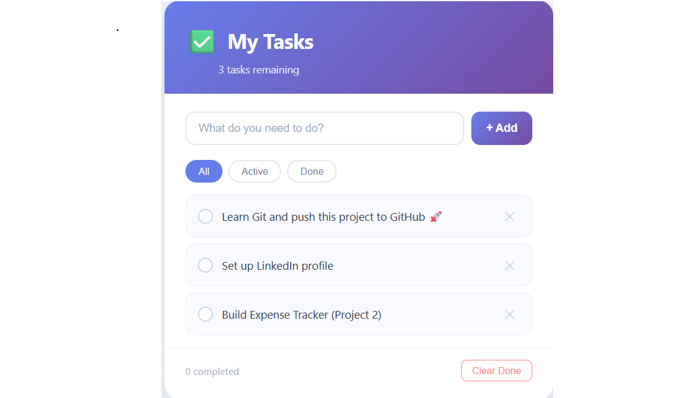

```markdown
# ✅ My Todo App

A simple, clean Todo application built with HTML, CSS, and JavaScript.

## 🔥 Features

- Add new tasks
- Mark tasks as done / undone
- Delete individual tasks
- Filter tasks: All / Active / Done
- Clear all completed tasks at once
- Task counter shows remaining tasks

## 🛠️ Technologies Used

- HTML5
- CSS3 (Flexbox, animations, CSS variables)
- Vanilla JavaScript (DOM manipulation, array methods)

## 📁 Project Structure

```
todo-app/
│
├── index.html    ← The structure (what appears on page)
├── style.css     ← The design (how it looks)
├── script.js     ← The logic (how it works)
└── README.md     ← This file
```

## 🚀 How to Run

1. Download or clone this project
2. Open `index.html` in any browser (Chrome, Firefox, Edge)
3. No installation needed!

## 📸 Screenshot



## 👨‍💻 Author

Phani — Python & Django Developer
- GitHub: [your-github-link]

